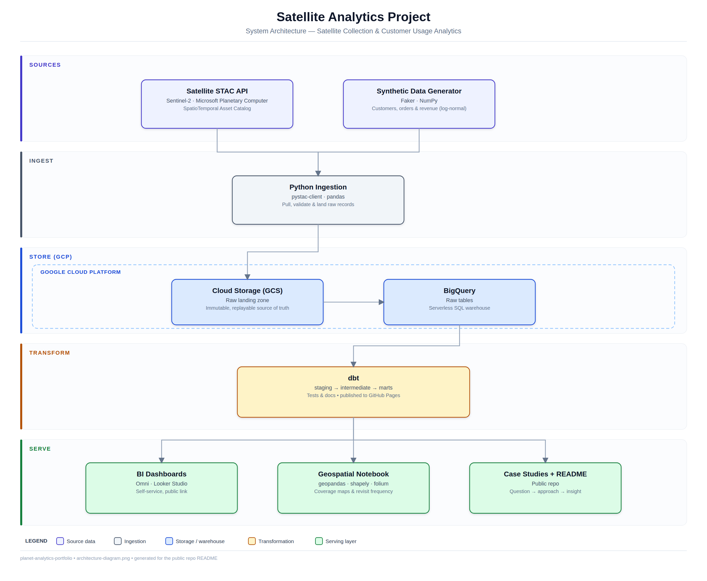

# STAC-data-analytics

**Satellite Collection & Customer Usage Analytics** — an end-to-end analytics stack that mirrors a real-world satellite-data analyst workflow: a real geospatial dataset combined with a synthetic business dataset, modeled with the modern data stack, and shipped as self-service dashboards that answer real stakeholder questions.

> **Status:** 🚧 In progress — see [roadmap](#roadmap) below for what's built and what's next.

---

## Business Questions

This project exists to answer three questions:

1. **Which regions/conditions have the worst satellite collection success rate, and why?**
2. **Which customer segments drive the most revenue per Area of Interest (AOI)?**
3. **How does AOI complexity affect fulfillment time?**

Every table, model, and dashboard in this repo traces back to one of these three.

---

## Architecture



Real satellite imagery metadata (pulled via STAC) and synthetic business data are landed in Google Cloud Storage, loaded into BigQuery, modeled through dbt (staging → intermediate → marts), and served through both a BI layer and a geospatial notebook. Each stage is covered by its own tests — see [Testing](#testing) below.

---

## Stack

| Layer | Tool |
|---|---|
| Version control | GitHub, public repo, real PR workflow |
| Ingestion | Python (`pystac-client` for imagery, `Faker`/`numpy` for synthetic data) |
| Warehouse | Google BigQuery (free tier) + GCS for raw landing |
| Transformation | dbt-bigquery: staging → intermediate → mart, with tests + docs |
| BI / self-service | Omni (free trial) + Looker Studio (permanent public link) |
| Geospatial analysis | geopandas, shapely, folium |
| Testing | pytest (ingestion) + dbt tests (models) + GitHub Actions (CI) |

---

## Testing

Every layer of this project has a matching testing step, rather than relying on validation happening only in the BI layer at the end:

- **`ingestion/tests/`** — pytest unit tests for the Python ingestion scripts: schema/shape checks on generated synthetic data, sane STAC query construction, and mocked-client tests for the BigQuery loader.
- **`dbt_project/tests/`** — dbt schema tests (`not_null`, `unique`, `relationships`, `accepted_values`) declared alongside each model, plus singular SQL tests for business-logic assumptions (e.g. `fulfillment_hours` should never be negative).
- **`.github/workflows/ci.yml`** — runs `pytest` and `dbt test` automatically on every push, so a broken model or script is caught before it reaches `main`.

See the project write-up for the full reasoning behind what's tested at each layer and why.

---

## Roadmap

### Scope & Foundation
- [x] Finalize the 3 business questions
- [x] Public repo live
- [ ] dbt project scaffolded
- [ ] GCP project + BigQuery + GCS set up
- [x] Rough architecture diagram

### Ingest
- [ ] Pull STAC metadata, validate it
- [ ] Build the synthetic business-data generator
- [ ] Sketch and implement the join logic
- [ ] Land both into BigQuery raw tables, basic data quality checks
- [ ] Unit tests for ingestion scripts (`ingestion/tests/`)

### Model
- [ ] dbt staging layer
- [ ] dbt intermediate layer (order/imagery join)
- [ ] dbt marts (one per business question)
- [ ] dbt tests (schema + singular) + documentation
- [ ] CI workflow running pytest + dbt test on every push
- [ ] Publish dbt docs to GitHub Pages

### BI Layer
- [ ] Build 2–3 dashboards in Omni
- [ ] Replicate key dashboards in Looker Studio (permanent public link)
- [ ] Geospatial notebook: coverage maps, cloud-cover distribution, revisit frequency

### Narrate & Ship
- [ ] Write the 3 case studies, insight-first (see [Case Study Format](#case-study-format))
- [ ] Final README pass with live links
- [ ] Record and link the walkthrough video
- [ ] Pin the repo, post about it

---

## Case Study Format

Each write-up in [`/case_studies`](./case_studies) leads with the finding, not the methodology — the headline insight comes first, so the "so what" doesn't get buried under process:

```markdown
# Collection Performance by Region

**Insight:** Southeast Asia's collection success rate drops to 41% during
monsoon months (June–September) — roughly half the year-round average
across other regions.

## The Question
Which regions/conditions have the worst satellite collection success
rate, and why?

## How I Got There
[approach: STAC pull, cloud-cover threshold, seasonal aggregation in the
`collection_performance` mart]

## What I'd Recommend
[the business action this insight points to]
```

The same principle carries into the dashboards themselves: each one leads with a headline stat/insight callout rather than a grid of filters the viewer has to manipulate to find the finding on their own.

---

## Live Links

*(added as each piece ships)*

- **Dashboard:** _TBD — Looker Studio public link_
- **dbt docs:** _TBD — hosted on GitHub Pages_
- **Case studies:** [`/case_studies`](./case_studies) — insight-first, see [format](#case-study-format)
- **Walkthrough video:** _TBD_

---

## Repo Structure

```
stac-data-analytics/
├── data/               # sample exports for reproducibility
├── ingestion/          # STAC pull, synthetic data generator, BigQuery loaders
│   └── tests/          # pytest unit tests for ingestion scripts
├── dbt_project/        # staging → intermediate → marts
│   └── tests/          # dbt schema + singular tests
├── notebooks/          # geospatial analysis
├── dashboards/         # BI links + screenshots
├── case_studies/       # insight-first write-up per business question
└── .github/workflows/  # CI (pytest + dbt test) and scheduled pipeline runs
```

---

## Running This Yourself

_Instructions will be filled in once ingestion and dbt are wired up — for now, see [`/data/README.md`](./data/README.md) for how sample data is provided so the project can be explored without live credentials._

---

## License

_TBD — add a license (e.g. MIT) once ready to make the repo fully reusable._
